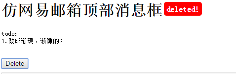

# DOM单页面特效
----------------------------


----------------------------
## 001-popUpMsg.html  
描述：仿网易邮箱顶部**消息框**  
需求：  

1. 写一个类似163邮箱顶部出现一会就消失的提示框; 
2. 便于使用;
3. 多个对象调用消息框`互不影响`，且不占用过多资源;
4. 更美观的`渐隐`、`渐显`、`向上收缩`等效果;

效果图：

  


----------------------

## 002-  JsPrinter.html
描述：JS字幕**打字效果**  
需求：  

1. 结合css和js实现打字效果;  
2. 最好使用OOP实现；

效果图:

 


js prototype

 


============================
# 添加oop_part
16:43 2015-10-13

1. minimalist.style.html  
	缺点是不节省资源，不提倡用；  
2. create.class.html  
	很好用的类定义方法，就是不知道兼容性如何  
3. single.class.html  
	js的单例模式：原型上写的属性和方法返回后失效。。。  
	也是合理的。


============================
# 添加BOM  
9:37 2015-11-15  

1. browserInfo.html  
	浏览器信息  
	
2. askBeforeShutDown.html  
	离开时刻弹出提示：数据未保存，是否离开。
	


	
	
	
	js游戏控制
	http://www.cnblogs.com/ljchow/archive/2010/06/10/1755182.html#xyqTTT
	该博客列表：http://www.cnblogs.com/ljchow/default.html?page=2
---
[MarkDown语法](http://sspai.com/25137)

  


```Javascript
$('div_id').innerHTML="123456";

var a=123;
```

```
http://bonsaiden.github.io/JavaScript-Garden/zh/


```